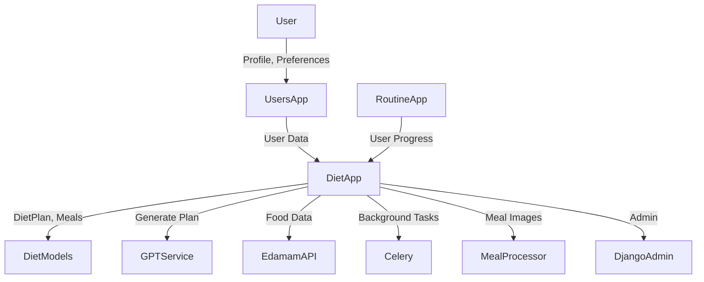

# Diet App Module

## Purpose
The Diet app provides AI-powered, personalized diet planning and nutrition management for users. It leverages GPT-3.5 Turbo to generate meal plans, integrates with external nutrition APIs (like Edamam), and supports user-specific food preferences, allergies, and goals. The app is designed for extensibility, robust admin management, and seamless integration with user and routine management systems.

## Main Components
- **Models**: Define food items, categories, user preferences, diet plans, meals, meal components, and daily advice.
- **Services**: Core logic for generating, saving, and reporting AI diet plans using GPT-3.5 Turbo.
- **Meal Processor**: Resolves ingredients, generates meal images, and integrates with nutrition APIs.
- **Tasks**: Celery background tasks for asynchronous plan and advice generation.
- **Admin**: Advanced Django admin interface for food management, Edamam import, and plan generation.
- **Views**: API endpoints and web views for plan generation, advice, and reporting.
- **AI Services**: Pydantic models and GPT prompt construction for strict, structured output.

## High-Level Architecture

## Key Features
- **AI Diet Plan Generation**: Uses GPT-3.5 Turbo for personalized, structured meal plans.
- **Food Database**: Edamam API integration for rich food and nutrition data.
- **User Preferences**: Handles likes, dislikes, allergies, and macro choices.
- **Meal Processing**: Ingredient resolution, image generation, and fallback logic.
- **Admin Tools**: Edamam import, image previews, and plan management.
- **Background Tasks**: Asynchronous plan and advice generation with Celery.
- **API & Web Views**: Endpoints for plan generation, advice, and reporting.
- **Logging & Monitoring**: Centralized logging for all operations and errors.

## Integration Points
- **Users App**: Relies on custom user model for health metrics and preferences.
- **Routine App**: Can be extended to align diet plans with workout routines.
- **Subscription App**: (Optional) Can restrict diet features to subscribed users.
- **Admin Interface**: Unified management for food, plans, and user preferences.
- **External APIs**: Edamam for food data, OpenAI for plan generation.

## Extensibility
- Add new nutrition APIs or AI models easily.
- Extend admin actions for bulk operations.
- Integrate with other health, fitness, or gamification modules.

## Example Usage
- User updates preferences in profile (Users App).
- Triggers diet plan generation (Diet App API or Admin).
- GPT-3.5 Turbo generates a JSON meal plan.
- Meals and components are saved, images generated.
- User views plan and daily advice via web or API.

---
For detailed API usage, see the code and docstrings in each module. 